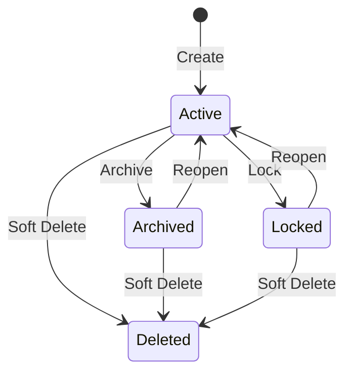

# Data Model: Topic Management

**Feature**: 016-topic-management
**Date**: 2026-02-05

## Entity Definitions

### Topic (Extended)

**Description**: Central entity representing a discussion subject. Extends existing `Topic` model with new fields for lifecycle management and search.

**Attributes**:

| Field              | Type       | Constraints                    | Description                                   |
| ------------------ | ---------- | ------------------------------ | --------------------------------------------- |
| id                 | UUID       | Primary Key                    | Unique identifier                             |
| title              | String     | 10-200 chars, NOT NULL         | Topic title (indexed for search)              |
| description        | String     | 50-5000 chars, NOT NULL        | Full topic description                        |
| slug               | String     | UNIQUE, NOT NULL               | URL-friendly identifier (generated from title) |
| status             | Enum       | Active/Archived/Locked/Deleted | Lifecycle status                              |
| visibility         | Enum       | Public/Private                 | Access control (default: Public)              |
| creatorId          | UUID       | FK to User, NOT NULL           | User who created the topic                    |
| createdAt          | DateTime   | Default: now()                 | Creation timestamp                            |
| lastActivityAt     | DateTime   | Default: now()                 | Last discussion/response timestamp            |
| participantCount   | Int        | Default: 0                     | Cached unique participant count               |
| discussionCount    | Int        | Default: 0                     | Cached discussion count                       |
| responseCount      | Int        | Default: 0                     | Cached response count                         |
| editedAt           | DateTime?  | Nullable                       | Last edit timestamp (if edited)               |
| deletedAt          | DateTime?  | Nullable                       | Soft delete timestamp                         |
| redirectToId       | UUID?      | FK to Topic (self), Nullable   | Redirect target for merged topics             |
| searchVector       | tsvector   | Generated column               | Full-text search vector (title + description) |

**Indexes**:
- Primary: `id`
- Unique: `slug`
- GIN: `searchVector` (full-text search)
- GIN: `title` (trigram similarity)
- Composite: `(status, createdAt DESC)` (filtering + sorting)
- Composite: `(lastActivityAt DESC)` (activity sorting)

**Relationships**:
- `creator`: Many-to-one with `User`
- `discussions`: One-to-many with `Discussion`
- `tags`: Many-to-many with `Tag` via `TopicTag`
- `edits`: One-to-many with `TopicEdit`
- `merges`: One-to-many with `TopicMerge` (as primary or secondary)
- `links`: Many-to-many with `Topic` (self) via `TopicLink`
- `redirectTo`: Many-to-one with `Topic` (self)

**Validation Rules**:
- `title`: Must be 10-200 characters, no HTML tags
- `description`: Must be 50-5000 characters, sanitized markdown only
- `slug`: Auto-generated from title, guaranteed unique via collision handling
- `status`: Can transition Active ↔ Archived, Active ↔ Locked, any → Deleted
- `visibility`: Can only be changed by creator or moderators

**State Transitions**:



---

### TopicEdit (New)

**Description**: Immutable audit trail of topic modifications for transparency and accountability.

**Attributes**:

| Field               | Type     | Constraints       | Description                         |
| ------------------- | -------- | ----------------- | ----------------------------------- |
| id                  | UUID     | Primary Key       | Unique identifier                   |
| topicId             | UUID     | FK to Topic       | Topic being edited                  |
| editorId            | UUID     | FK to User        | User who made the edit              |
| editedAt            | DateTime | Default: now()    | Edit timestamp                      |
| previousTitle       | String?  | Nullable          | Title before edit (null if unchanged) |
| newTitle            | String?  | Nullable          | Title after edit (null if unchanged)  |
| previousDescription | String?  | Nullable          | Description before edit             |
| newDescription      | String?  | Nullable          | Description after edit              |
| previousTags        | String[] | Default: []       | Tags before edit                    |
| newTags             | String[] | Default: []       | Tags after edit                     |
| changeReason        | String?  | Max 500 chars     | Optional reason for edit            |
| flaggedForReview    | Boolean  | Default: false    | Significant edit requiring moderation |

**Indexes**:
- Primary: `id`
- Composite: `(topicId, editedAt DESC)` (topic edit history)

**Relationships**:
- `topic`: Many-to-one with `Topic`
- `editor`: Many-to-one with `User`

**Validation Rules**:
- At least one of `previousTitle`/`newTitle` or `previousDescription`/`newDescription` or `previousTags`/`newTags` must be non-null
- `changeReason`: Max 500 characters
- `flaggedForReview`: Set to true if topic has 50+ responses and title changed or >50% description rewrite

**Business Rules**:
- Records are immutable (never updated or deleted)
- Created automatically on every topic update
- Only visible to topic creator, moderators, and admins

---

### TopicTag (Extended)

**Description**: Many-to-many association between topics and tags for categorization.

**Attributes**:

| Field     | Type     | Constraints  | Description        |
| --------- | -------- | ------------ | ------------------ |
| id        | UUID     | Primary Key  | Unique identifier  |
| topicId   | UUID     | FK to Topic  | Associated topic   |
| tagName   | String   | Max 30 chars | Tag text           |
| createdAt | DateTime | Default: now() | Association timestamp |

**Indexes**:
- Primary: `id`
- Composite: `(topicId, tagName)` (unique per topic)
- Index: `tagName` (tag filtering)

**Relationships**:
- `topic`: Many-to-one with `Topic`

**Validation Rules**:
- `tagName`: Max 30 characters, lowercase, alphanumeric + hyphens only
- Maximum 5 tags per topic enforced at application level

**Business Rules**:
- Tags are free-form text (not predefined taxonomy)
- Tags auto-converted to lowercase for consistency
- Duplicate tags within same topic prevented by unique constraint

---

### TopicLink (New)

**Description**: Bidirectional relationships between related topics created by moderators.

**Attributes**:

| Field       | Type     | Constraints       | Description              |
| ----------- | -------- | ----------------- | ------------------------ |
| id          | UUID     | Primary Key       | Unique identifier        |
| topicAId    | UUID     | FK to Topic       | First topic in link      |
| topicBId    | UUID     | FK to Topic       | Second topic in link     |
| creatorId   | UUID     | FK to User        | Moderator who created link |
| createdAt   | DateTime | Default: now()    | Link creation timestamp  |
| linkReason  | String?  | Max 500 chars     | Why topics are related   |

**Indexes**:
- Primary: `id`
- Composite: `(topicAId, topicBId)` (unique bidirectional link)
- Index: `topicAId` (find links for topic)
- Index: `topicBId` (find links for topic)

**Relationships**:
- `topicA`: Many-to-one with `Topic`
- `topicB`: Many-to-one with `Topic`
- `creator`: Many-to-one with `User` (moderator)

**Validation Rules**:
- `topicAId` ≠ `topicBId` (can't link topic to itself)
- Only one link between any two topics (enforced by unique constraint)
- Link order doesn't matter: (A, B) same as (B, A)

**Business Rules**:
- Only moderators can create topic links
- Links are bidirectional (shown on both topics)
- Soft-deleted topics' links are hidden but not removed

---

### TopicMerge (New)

**Description**: Audit trail of topic merge operations for transparency and potential rollback.

**Attributes**:

| Field             | Type     | Constraints    | Description                      |
| ----------------- | -------- | -------------- | -------------------------------- |
| id                | UUID     | Primary Key    | Unique identifier                |
| primaryTopicId    | UUID     | FK to Topic    | Target topic (discussions moved here) |
| secondaryTopicId  | UUID     | FK to Topic    | Source topic (soft-deleted after merge) |
| moderatorId       | UUID     | FK to User     | Moderator who performed merge    |
| mergedAt          | DateTime | Default: now() | Merge timestamp                  |
| mergeReason       | String   | Max 1000 chars | Why topics were merged           |
| discussionsMoved  | Int      | NOT NULL       | Count of discussions migrated    |
| rollbackDeadline  | DateTime | mergedAt + 30d | After this, rollback unavailable |

**Indexes**:
- Primary: `id`
- Index: `primaryTopicId` (find merges into topic)
- Index: `secondaryTopicId` (find merges from topic)

**Relationships**:
- `primaryTopic`: Many-to-one with `Topic`
- `secondaryTopic`: Many-to-one with `Topic`
- `moderator`: Many-to-one with `User`

**Validation Rules**:
- `primaryTopicId` ≠ `secondaryTopicId`
- `mergeReason`: Required, max 1000 characters
- `rollbackDeadline`: Auto-calculated as mergedAt + 30 days

**Business Rules**:
- Only moderators can merge topics
- Merge operations are atomic (transaction-based)
- Secondary topic soft-deleted and redirects to primary
- Rollback possible within 30 days by un-deleting secondary and moving discussions back

---

### TopicAnalytics (New)

**Description**: Pre-aggregated analytics data for topics, updated by background job.

**Attributes**:

| Field                | Type     | Constraints    | Description                           |
| -------------------- | -------- | -------------- | ------------------------------------- |
| id                   | UUID     | Primary Key    | Unique identifier                     |
| topicId              | UUID     | FK to Topic    | Topic being analyzed (unique)         |
| calculatedAt         | DateTime | Default: now() | Last calculation timestamp            |
| responsesPerDay      | Int[]    | Length: 30     | Response counts for past 30 days      |
| perspectiveDiversity | JSON     | Nullable       | Perspective breakdown (progressive/conservative/moderate) |
| peakActivityHour     | Int?     | 0-23           | Hour with most responses              |
| avgResponseLength    | Int?     | Nullable       | Average response word count           |

**Indexes**:
- Primary: `id`
- Unique: `topicId` (one analytics record per topic)

**Relationships**:
- `topic`: One-to-one with `Topic`

**Validation Rules**:
- `responsesPerDay`: Array of exactly 30 integers (day 0 = today, day 29 = 30 days ago)
- `peakActivityHour`: Integer between 0 and 23 (UTC hour)

**Business Rules**:
- Updated hourly by background job
- Only created for topics with 10+ responses
- Stale data acceptable (up to 1 hour old)

---

## Prisma Schema Extensions

```prisma
model Topic {
  id                String       @id @default(uuid())
  title             String
  description       String
  slug              String       @unique
  status            TopicStatus  @default(Active)
  visibility        TopicVisibility @default(Public)
  creatorId         String
  creator           User         @relation(fields: [creatorId], references: [id])
  createdAt         DateTime     @default(now())
  lastActivityAt    DateTime     @default(now())
  participantCount  Int          @default(0)
  discussionCount   Int          @default(0)
  responseCount     Int          @default(0)
  editedAt          DateTime?
  deletedAt         DateTime?
  redirectToId      String?
  redirectTo        Topic?       @relation("TopicRedirect", fields: [redirectToId], references: [id])

  discussions       Discussion[]
  tags              TopicTag[]
  edits             TopicEdit[]
  mergesAsPrimary   TopicMerge[] @relation("PrimaryTopic")
  mergesAsSecondary TopicMerge[] @relation("SecondaryTopic")
  linksAsA          TopicLink[]  @relation("TopicA")
  linksAsB          TopicLink[]  @relation("TopicB")
  redirectFrom      Topic[]      @relation("TopicRedirect")
  analytics         TopicAnalytics?

  @@index([status, createdAt(sort: Desc)])
  @@index([lastActivityAt(sort: Desc)])
}

model TopicEdit {
  id                  String   @id @default(uuid())
  topicId             String
  topic               Topic    @relation(fields: [topicId], references: [id])
  editorId            String
  editor              User     @relation(fields: [editorId], references: [id])
  editedAt            DateTime @default(now())
  previousTitle       String?
  newTitle            String?
  previousDescription String?
  newDescription      String?
  previousTags        String[] @default([])
  newTags             String[] @default([])
  changeReason        String?
  flaggedForReview    Boolean  @default(false)

  @@index([topicId, editedAt(sort: Desc)])
}

model TopicTag {
  id        String   @id @default(uuid())
  topicId   String
  topic     Topic    @relation(fields: [topicId], references: [id])
  tagName   String
  createdAt DateTime @default(now())

  @@unique([topicId, tagName])
  @@index([tagName])
}

model TopicLink {
  id          String   @id @default(uuid())
  topicAId    String
  topicA      Topic    @relation("TopicA", fields: [topicAId], references: [id])
  topicBId    String
  topicB      Topic    @relation("TopicB", fields: [topicBId], references: [id])
  creatorId   String
  creator     User     @relation(fields: [creatorId], references: [id])
  createdAt   DateTime @default(now())
  linkReason  String?

  @@unique([topicAId, topicBId])
  @@index([topicAId])
  @@index([topicBId])
}

model TopicMerge {
  id                String   @id @default(uuid())
  primaryTopicId    String
  primaryTopic      Topic    @relation("PrimaryTopic", fields: [primaryTopicId], references: [id])
  secondaryTopicId  String
  secondaryTopic    Topic    @relation("SecondaryTopic", fields: [secondaryTopicId], references: [id])
  moderatorId       String
  moderator         User     @relation(fields: [moderatorId], references: [id])
  mergedAt          DateTime @default(now())
  mergeReason       String
  discussionsMoved  Int
  rollbackDeadline  DateTime

  @@index([primaryTopicId])
  @@index([secondaryTopicId])
}

model TopicAnalytics {
  id                   String   @id @default(uuid())
  topicId              String   @unique
  topic                Topic    @relation(fields: [topicId], references: [id])
  calculatedAt         DateTime @default(now())
  responsesPerDay      Int[]
  perspectiveDiversity Json?
  peakActivityHour     Int?
  avgResponseLength    Int?
}

enum TopicStatus {
  Active
  Archived
  Locked
  Deleted
}

enum TopicVisibility {
  Public
  Private
}
```

## Migration Strategy

### Phase 1: Schema Extensions

1. Add new fields to existing `Topic` table:
   - `slug`, `status`, `visibility`, `lastActivityAt`, counts, `editedAt`, `deletedAt`, `redirectToId`
2. Create new tables: `TopicEdit`, `TopicLink`, `TopicMerge`, `TopicAnalytics`
3. Extend `TopicTag` with `createdAt`

### Phase 2: Data Backfill

1. Generate slugs for existing topics from titles
2. Calculate and backfill participant/discussion/response counts
3. Set `status=Active`, `visibility=Public` for existing topics
4. Backfill `lastActivityAt` from most recent discussion/response

### Phase 3: Index Creation

1. Add full-text search indexes (GIN on `searchVector`)
2. Add trigram similarity index on `title`
3. Add composite indexes for filtering/sorting

### Migration Script

```typescript
// Run after Prisma migrate
async function backfillTopicData() {
  const topics = await prisma.topic.findMany();

  for (const topic of topics) {
    // Generate slug
    const slug = generateSlug(topic.title);

    // Calculate counts
    const discussions = await prisma.discussion.findMany({
      where: { topicId: topic.id },
      include: { responses: true }
    });

    const discussionCount = discussions.length;
    const responseCount = discussions.reduce((sum, d) => sum + d.responses.length, 0);
    const participantIds = new Set(discussions.flatMap(d => d.responses.map(r => r.userId)));

    // Find last activity
    const lastResponse = await prisma.response.findFirst({
      where: { discussion: { topicId: topic.id } },
      orderBy: { createdAt: 'desc' }
    });

    // Update topic
    await prisma.topic.update({
      where: { id: topic.id },
      data: {
        slug,
        status: 'Active',
        visibility: 'Public',
        discussionCount,
        responseCount,
        participantCount: participantIds.size,
        lastActivityAt: lastResponse?.createdAt || topic.createdAt
      }
    });
  }
}
```

## Data Integrity Constraints

### Application-Level Constraints

1. **Tag Limit**: Maximum 5 tags per topic (validated in DTO)
2. **Edit Frequency**: Rate limit topic edits to 10 per day (prevent abuse)
3. **Merge Validation**: Cannot merge if either topic has active discussions in past 24 hours (prevent disruption)
4. **Slug Uniqueness**: Collision handling via numeric suffix (e.g., "topic-name-2")

### Database Constraints

1. **Foreign Keys**: Cascade rules
   - Topic deleted → Edit history preserved (no cascade)
   - Topic deleted → Tags cascade delete
   - Topic deleted → Links cascade delete
   - User deleted → Topic ownership transfers to "Community" user (special handling)

2. **Check Constraints**:
   - `title` length: 10-200 characters
   - `description` length: 50-5000 characters
   - `tagName` length: 1-30 characters
   - Counts: `>= 0`

3. **Unique Constraints**:
   - `Topic.slug` unique
   - `TopicTag(topicId, tagName)` unique
   - `TopicLink(topicAId, topicBId)` unique (prevent duplicate links)
   - `TopicAnalytics.topicId` unique (one-to-one)

## Query Patterns

### Most Common Queries

1. **List Active Topics (Filtered + Sorted)**:
   ```sql
   SELECT * FROM "Topic"
   WHERE status = 'Active' AND visibility = 'Public'
   ORDER BY "lastActivityAt" DESC
   LIMIT 20 OFFSET 0;
   ```

2. **Full-Text Search**:
   ```sql
   SELECT *, ts_rank(search_vector, to_tsquery('english', 'query')) as rank
   FROM "Topic"
   WHERE search_vector @@ to_tsquery('english', 'query')
   ORDER BY rank DESC, "lastActivityAt" DESC
   LIMIT 20;
   ```

3. **Duplicate Detection (Trigram)**:
   ```sql
   SELECT id, title, similarity(title, 'new topic title') as score
   FROM "Topic"
   WHERE similarity(title, 'new topic title') > 0.7
   ORDER BY score DESC
   LIMIT 5;
   ```

4. **Topic with Tags and Analytics**:
   ```sql
   SELECT t.*, array_agg(tt."tagName") as tags, ta.*
   FROM "Topic" t
   LEFT JOIN "TopicTag" tt ON t.id = tt."topicId"
   LEFT JOIN "TopicAnalytics" ta ON t.id = ta."topicId"
   WHERE t.id = $1
   GROUP BY t.id, ta.id;
   ```

5. **Edit History**:
   ```sql
   SELECT * FROM "TopicEdit"
   WHERE "topicId" = $1
   ORDER BY "editedAt" DESC
   LIMIT 10;
   ```

### Performance Expectations

| Query                 | Expected Latency | Index Used                       |
| --------------------- | ---------------- | -------------------------------- |
| List active topics    | <50ms            | (status, createdAt)              |
| Full-text search      | <100ms           | GIN search_vector                |
| Duplicate detection   | <50ms            | GIN title trigram                |
| Topic details         | <10ms            | Primary key                      |
| Edit history          | <20ms            | (topicId, editedAt)              |
| Tag filter            | <100ms           | TopicTag.tagName                 |
| Analytics load        | <20ms            | TopicAnalytics.topicId (unique)  |
